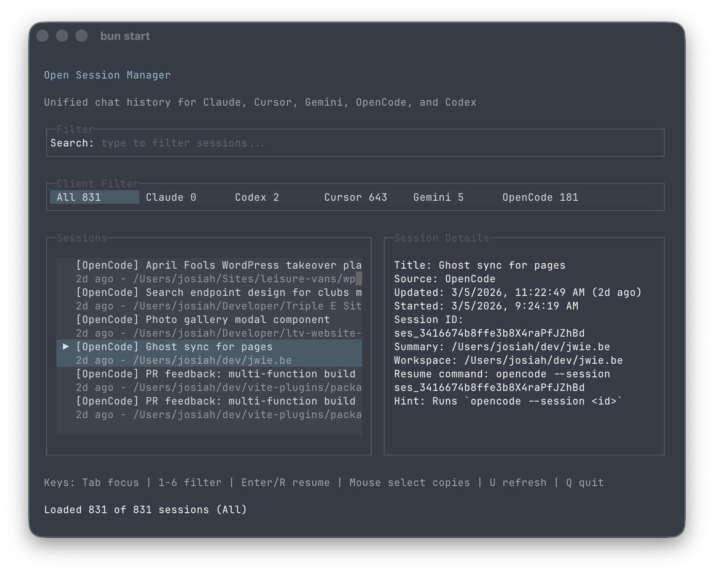

# Open Session

Open Session is a terminal app for finding and resuming local coding agent sessions across Claude Code, Codex, Cursor, Gemini, and OpenCode.



## Installation

```bash
curl -fsSL https://raw.githubusercontent.com/josiahwiebe/opensession/main/scripts/install.sh | bash
```

## Quick Start

```bash
opensession
// or `ops`
```

Use the arrow keys to browse sessions, type to search, and press Enter to resume the selected session.

## Features

- Aggregate local sessions from multiple coding tools
- Search and filter sessions from one interface
- Sort by most recent activity
- Inspect session metadata and transcript paths
- Resume supported sessions without digging through local files

## Supported Platforms

- macOS
- Linux

## Supported Sources

- Claude Code
- OpenAI Codex
- Cursor
- Gemini CLI
- OpenCode

## CLI

```bash
opensession --help
opensession --version
ops --version
```

## How it works

Open Session scans local session history from supported tools, normalizes the results into a single list, and sorts them by recent activity. When a tool supports resuming from the command line, Open Session can jump directly back into that session.

## Development

### Run from Source

```bash
bun install
bun start
```

### Build Release Artifacts

```bash
bun run build:release
```

This creates a release archive for the current machine in dist/release.

To force a specific target, such as in CI:

```bash
OPEN_SESSION_TARGET=bun-linux-x64 OPEN_SESSION_SUFFIX=linux-x64 bun run build:release
```

## License

MIT
